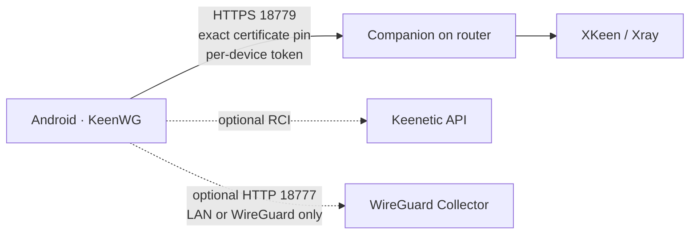

# KeenWG

[](https://github.com/apex-intellect/keenwg/releases/latest)
[](https://github.com/apex-intellect/keenwg/actions/workflows/verify.yml)
[](LICENSE)


KeenWG — локальная Android-панель для Keenetic и Netcraze. Она объединяет управление WireGuard-доступами, ручной выбор XKeen/VLESS-подключения, маршруты Xray, IP-исключения, статические адреса, диагностику и резервное копирование. Облачного аккаунта и внешнего управляющего сервера нет.

Линейка 2.x оставляет только один защищённый путь управления XKeen: локальный компонент на роутере (в технической документации — Companion) по HTTPS с точным pin сертификата и отдельным отзываемым токеном каждого телефона. В приложении это называется просто «защищённый доступ». Старый самостоятельный HTTP-сервис удалён.

## Возможности

- создание, включение, ротация и отзыв WireGuard-доступов;
- несколько профилей роутеров с секретами в Android Keystore;
- добавление VLESS-ссылок и URL подписок прямо в приложение;
- ручное обновление подписки, проверка узла и подтверждённый выбор страны;
- доменные правила, GeoSite, IP/CIDR-исключения и объяснение выбранного маршрута;
- статические DHCP-адреса для устройств Keenetic;
- сценарии маршрутизации с preview, plan ID, read-back и откатом;
- зашифрованный owner-only backup/restore;
- доверенные телефоны со scope `viewer`, `operator` и `owner`;
- безопасный диагностический отчёт без токенов, ключей, URL, MAC и полных IP;
- необязательная локальная история WireGuard через read-only Collector.

Все сетевые изменения запускаются вручную. KeenWG не обновляет подписку, не меняет страну и не применяет сценарий при открытии приложения или в фоне.

## Архитектура



Модули независимы:

- Companion нужен для подключений, маршрутов, сценариев, backup, диагностики и доверенных устройств;
- RCI нужен для WireGuard peer и статических адресов;
- Collector нужен только для истории и не влияет на текущее состояние или управление.

## Быстрый старт

1. Скачайте подписанный APK из [последнего релиза](https://github.com/apex-intellect/keenwg/releases/latest).
2. Для установки защищённого компонента нужен Entware. Если его нет, KeenWG покажет [инструкцию сообщества XKeen](https://github.com/Corvus-Malus/XKeen) и ничего не будет форматировать или устанавливать сам. Сам XKeen необязателен: без него недоступны только связанные с ним подключения и маршруты.
3. Откройте «Система» → «Подключение к роутеру».
4. Один раз введите логин и пароль, с которыми устанавливали XKeen/Entware. Обычно это `root`, порт `222`; адрес нового профиля — `192.168.1.1`, его можно изменить на этом же экране.
5. KeenWG сам проверит роутер, сохранит существующие XKeen/Xray/ASC/WireGuard и создаст для телефона отдельный отзываемый доступ. Повторно вводить пароль для поддерживаемых разделов не нужно.
6. При желании откройте «Расширенные настройки» и подключите независимые модули: Keenetic API для WireGuard и статических адресов, Collector — только для истории.

Если актуальный роутерный компонент уже установлен и его бинарник совпадает, мастер выполняет только привязку телефона: бинарник и конфигурация на роутере не перезаписываются. При несовпадении той же версии выполняется проверяемое транзакционное обновление. Обновление сохраняет identity, доверенные устройства, активный маршрут, подписки и пользовательские правила.

Подробный процесс и варианты восстановления: [настройка Companion](docs/COMPANION-SETUP.md).

## Совместимость

Физически подтверждённая платформа:

- Netcraze Hopper SE (NC-3812);
- KeeneticOS 5.01.C.1.0-0;
- ARM64 и Entware;
- XKeen 2.0 и Xray 26.3.27.

Другие ARM64-модели могут работать, но считаются experimental до прохождения полного физического цикла. MIPS/MIPSel, публичный/WAN listener Companion и автоматическая смена страны не поддерживаются. Точная матрица: [docs/COMPATIBILITY.md](docs/COMPATIBILITY.md).

## Сборка

Требуются JDK 17 и Android SDK 35. Репозиторий содержит Gradle Wrapper 8.12.

```powershell
$env:ANDROID_HOME = "$env:LOCALAPPDATA\Android\Sdk"
.\gradlew.bat :app:testDebugUnitTest :app:lintDebug :app:assembleDebug
```

Linux/macOS:

```bash
./gradlew :app:testDebugUnitTest :app:lintDebug :app:assembleDebug
```

Companion и Collector требуют Go 1.26.5:

```bash
(cd xkeen-control && go test ./... && go vet ./...)
(cd collector && go test ./... && go vet ./...)
```

Релизная проверка дополнительно запускает race detector, `govulncheck`, fuzz targets, shell lifecycle, Android lint, SBOM и secret scan. Инструкции для изменений находятся в [CONTRIBUTING.md](CONTRIBUTING.md).

## Безопасность и приватность

Не публикуйте subscription URL, VLESS URI, WireGuard private key, пароль доступа к роутеру, pairing secret, device token, backup, hostname, MAC или полный публичный IP. Для отчёта используйте только встроенный санитизированный экспорт.

- [Security policy](SECURITY.md)
- [Модель безопасности](docs/SECURITY-MODEL.md)
- [Privacy](PRIVACY.md)
- [Политика подписи APK](docs/SIGNING.md)

## Лицензия

Apache License 2.0. Названия WireGuard, Keenetic, Netcraze, XKeen и Xray принадлежат их владельцам; упоминание означает совместимость, а не одобрение проекта.
